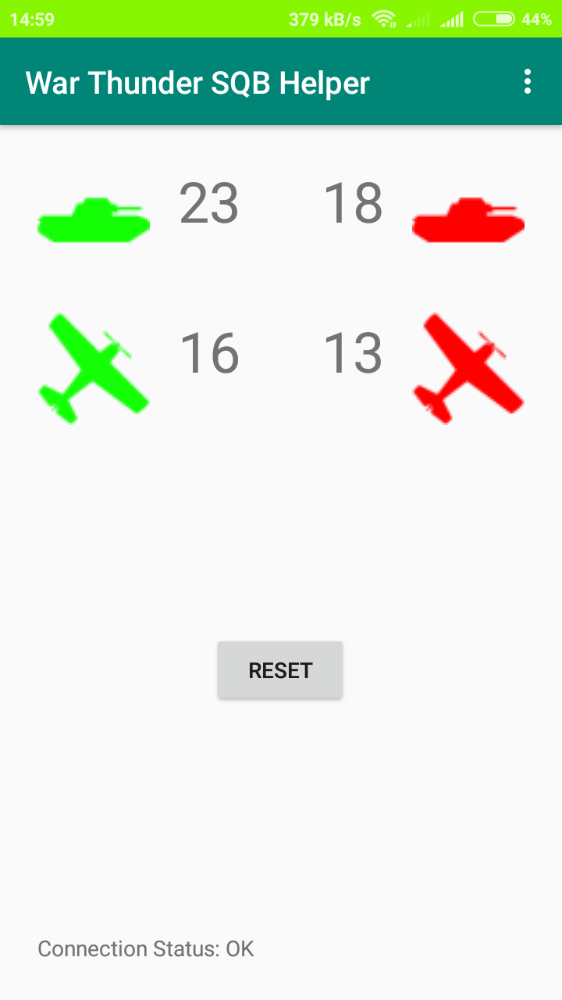

# War Thunder SQB Helper

An Android application created to help tracking numbers of remaining ally and enemy units in War Thunder Squadron Battles.
It parses JSON data streamed by the game and displays four numbers representing amount of remaining planes and ground units of each side.

## Prerequisites:
1. Connected to a local WiFi network with your phone/tablet.
2. Check [the local IP address of the PC](https://kb.wisc.edu/27309) you are running War Thunder on.
3. In the application settings menu type in your squadron tag and that IP address.

- If the numbers doesn't update at all, check if you can access 8111 port of this IP with a phone/tablet web browser.
 For example, if your IP address is 192.168.0.1, type in 192.168.0.1:8111.
 If the game is running and you don't see the gray page with game info, application won't work unless you configure your router/PC/local network.

- At the moment the application works only when the War Thunder in-game language is set to English or Polish.
If you want another language added, check the ParseJSON.java file for RegExp patterns.
- Press the "Reset" button every time you start a battle to reset numbers.

## Changelog
- v0.2 - added Polish language support, fixed typos
- v0.1 - first version

## Download
[Here](https://github.com/gserej/WarThunderSQBHelper/raw/master/app/release/WT_SQB_Helper_v0.2.apk)
